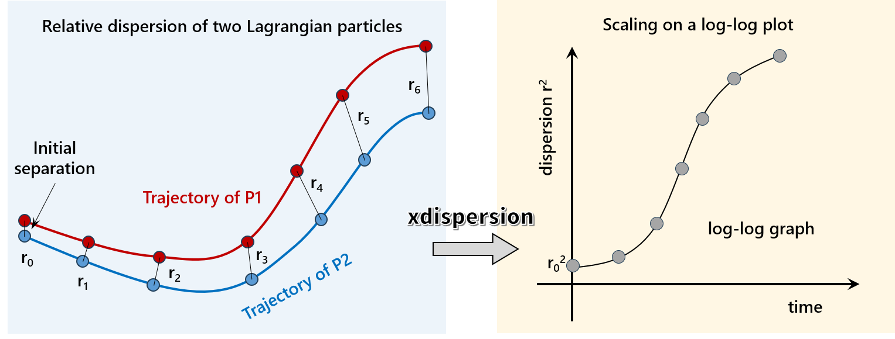
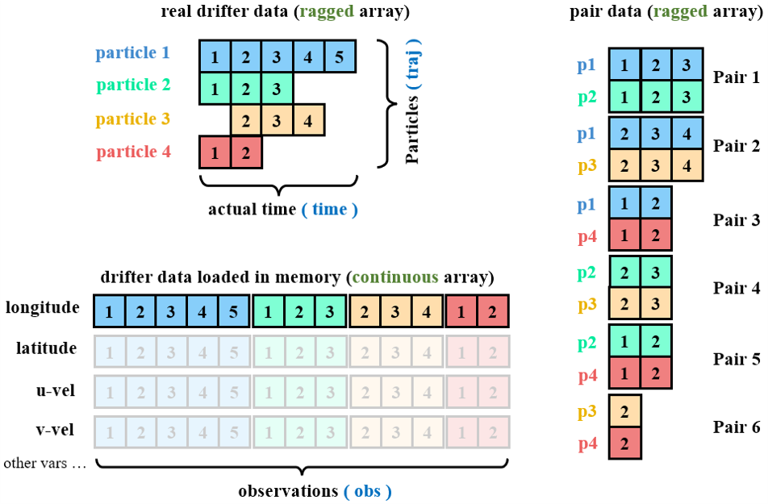
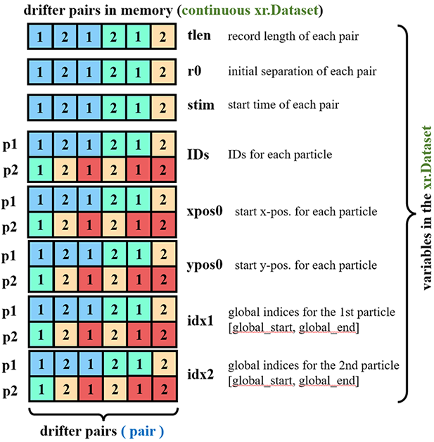
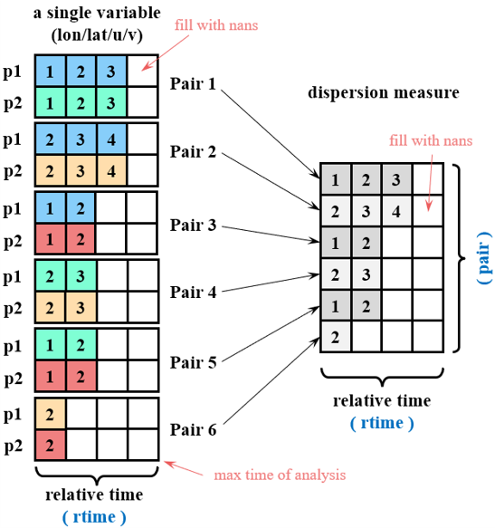

# xdispersion



## 1. Introduction
The package is designed for analyzing relative dispersion behaviors of Lagrangian particle pairs (two-particle) in a statistical fashion.  It is based on the data structure of [`xarray`](https://xarray.dev/) and hence [`dask`](https://docs.dask.org/en/stable/), so that one can leverage the power of multi-dimensional labelled arrays and out-of-core calculations.

 
---
## 2. How to install
**Requirements**
`xdispersion` is developed under the environment with `xarray` (=version 0.15.0), `dask` (=version 2.11.0), `numpy` (=version 1.15.4), `scipy` (=version 1.13.1), `tqdm` (=version 4.66.5), `xhistogram` (=version 0.3.2), `mpmath` (=version 1.2.0).  Older versions of these packages are not well tested.

**Install via pip**
```
pip install xdispersion # not yet
```

**Install via conda**
```
conda install -c conda-forge xdispersion # not yet
```

**Install from github**
```
git clone https://github.com/miniufo/xdispersion.git
cd xdispersion
python setup.py install
```


## 3. How to do this nicely and efficiently
### 3.1 Problems of representing the data
For Lagrangian data represented in multi-dimensional `xarray.DataArray`, one of the major problems is that the lengths of Lagrangian trajectories are not the same (see **real drifter data** in the figure).  So it is impossible to use a `traj` dimension to represent different trajectories.

The second problem is how to represent the dataset of particle pairs.  For example, if there are 4 particles P1, P2, P3, and P4, through combination one would get 6 pairs (see **pair data** in the figure).  Pair data are still of difference lengths.  More importantly, each trajectory is duplicated three times so that the overall storage would be greatly increased.



### 3.2 Solutions to the problems

**The first problem** is solved by introducing the [ragged array from CloudDrift project](https://clouddrift.org/) based on [Awkward Array](https://awkward-array.org/): All the trajectories are connected head to tail, forming an `obs` dimension.  This is memory and storage efficient, but requires extra efforts to retrieve the data of each trajectory.

**The second problem** is solved here by grouping the basic information of particle pairs `pairs` (e.g., pair length, initial separations, initial time, initial locations..., see **drifter pairs in memory** in the figure below) into a `xr.Dataset`, instead of duplicating all the data.  Therefore, this design is memory efficient.  In addition, this allows one to filter `pairs` and select those satisfying specific criterions using `xarray`'s functionality:

```python
pairs = get_all_pairs(drifters)

# select original pairs whose initial separation r0 is within a given range
condition = np.logical_and(pairs.r0>rmin, pairs.r0<rmax)
origin_pairs = pairs.where(condition, drop=True).astype(pairs.dtypes)
```

Also, one can perform statistics (like histogram of r0) using pair information `pairs` or plot the statistics (like initial locations), without loading all the data into memory.



### 3.3 Calculations of dispersion measures

To calculate dispersion measures, like relative dispersion $r^2(t)=\left<|\mathbf{x_i}-\mathbf{x_j}|^2\right>$, one need to load the full data into memory.  This means that we need to specify a maximum time of analysis (`maxtlen`): pairs will be truncated if they are longer than `maxtlen`, and will be padded with nans if they are shorter than `maxtlen`.  This is shown schematically below.  Notice that the time is not the actual date/time, so we call it relative time `rtime`.



This is not memory efficient, as already mentioned.  One can sum up all the pairs online without allocating a memory of `pair`×`rtime` size.  But we choose to keep the `['pair', 'rtime']` dimensions in the present design because:
- one can check intermediate results before taking average over `pair` dimension;
- one can get the number of observations by counting the non-nans values, which generally vary with time;
- one can perform an estimate of the errorbar through bootstrapping along the `pair` dimension;
- one can use `chunks` along `pair` dimension if there are many pairs, when `dask` is used.

Following this design, we have a function `get_variable(pairs, vname)` to load a variable (positions or velocities) from `pairs` into memory:

```python
lon = get_variable(pairs, 'lon')
lat = get_variable(pairs, 'lat')
```

The returned variable is of size `['pair', 'particle', 'rtime']`, and relative dispersion is then calculated as:

```python
lon1 = lon.isel(particle=0) # 1st particle
lon2 = lon.isel(particle=1) # 2nd particle
lat1 = lat.isel(particle=0) # 1st particle
lat2 = lat.isel(particle=1) # 2nd particle

# r2(t) is only a function of rtime
r2 = (great_circle(lon1, lon2, lat1, lat2) ** 2.0).mean('pair')
```

which is clean and clear, as it follows almost to its mathematical expression.

---
## 3. Examples

Notebooks are given [here](https://github.com/miniufo/xdispersion/docs/source/notebooks/) demonstrating how to use the package.

